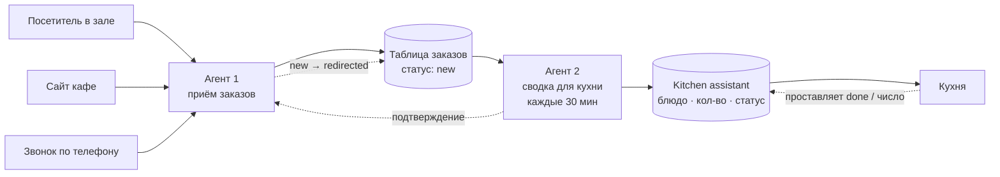

# Автоматизация приёма и приготовления заказов для кафе

**Кейс из портфолио: два AI/no-code агента поверх Google Sheets, которые убирают ручную сортировку заказов на кухне.**

## Проблема клиента

Небольшое кафе принимает предзаказы из трёх источников:

- посетитель делает заказ на месте;
- заказ оформляется через сайт кафе;
- заказ принимается по телефону.

Заказы приходят **сгруппированными по клиенту** ("Иван: салат, сэндвич, круассан"). Кухне же нужен список, **сгруппированный по блюду** ("салат ×5, сэндвич ×3, круассан ×2"), да ещё и отсортированный по объёму готовки. Раньше это пересчитывали вручную — терялось время и закрадывались ошибки.

## Решение

Два лёгких агента поверх обычной Google Таблицы, без внедрения отдельной POS/ERP-системы:

- **Агент 1** — принимает заказы из всех трёх источников в единую таблицу, следит за статусами и ведёт архив по дням/месяцам.
- **Агент 2** — каждые 30 минут забирает только новые заказы, пересчитывает их по блюдам и обновляет рабочий список для кухни, учитывая, что кухня уже приготовила, а что нет.

Кухня работает с одним экраном: что готовить и сколько, всегда актуально, всегда отсортировано по важности.

## Как это выглядит



Полная версия диаграммы с деталями — в [docs/02-architecture.md](docs/02-architecture.md).

**[→ Полная демонстрация (showcase.html)](showcase.html)** — та же история одной страницей, с живым мини-демо экрана кухни и таблицей бюджета, готова для встраивания на сайт консалтинга.

## Структура репозитория

```
├── README.md                      — этот файл
├── docs/
│   ├── 01-overview.md             — бизнес-контекст и цели проекта
│   ├── 02-architecture.md         — архитектура системы (диаграмма)
│   ├── 03-order-flow.md           — жизненный цикл заказа, ротация листов/таблиц
│   ├── 04-agent-prompts.md        — финальные промпты Агента 1 и Агента 2
│   └── 05-budget-and-hosting.md   — сравнение вариантов реализации и бюджет
└── mockups/
    ├── website-order-widget.html  — окно предзаказа на сайте (wireframe)
    ├── internal-orders-table.html — как заказы выглядят во внутренней системе
    └── kitchen-display.html       — рабочий экран кухни с сортировкой
```

Мокапы — статичные HTML-файлы, их можно открыть прямо в браузере (двойной клик или через GitHub Pages).

## Дисклеймер

Это демонстрационный кейс, подготовленный как учебный пример архитектуры AI-агентов для автоматизации небольшого бизнеса. Название кафе, блюда и данные — тестовые/вымышленные. Реализация опирается на Google Sheets как на "базу данных", что осознанно выбрано для небольшого кафе — см. обоснование в [docs/05-budget-and-hosting.md](docs/05-budget-and-hosting.md).

---

Хотите такое же решение для своего кафе или другого малого бизнеса — пишите: [контакты на сайте консалтинга].
