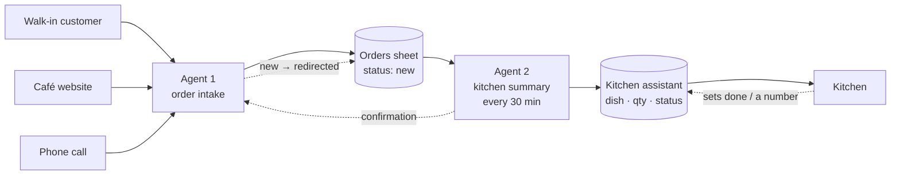

# Order Intake & Kitchen Prep Automation for a Café

**Portfolio case study: two AI/no-code agents on top of Google Sheets that remove manual order sorting from the kitchen.**

## The client's problem

A small café takes pre-orders from three channels:

- a walk-in customer ordering on the spot;
- an order placed through the café's website;
- an order phoned in.

Orders arrive **grouped by customer** ("Ivan: salad, sandwich, croissant"). The kitchen needs the opposite grouping — **by dish** ("salad ×5, sandwich ×3, croissant ×2"), sorted by how much needs to be cooked. Recalculating this by hand cost time and introduced mistakes.

## The solution

Two lightweight agents on top of an ordinary Google Sheet — no separate POS/ERP system needed:

- **Agent 1** — collects orders from all three channels into a single sheet, tracks their status, and archives them by day/month.
- **Agent 2** — every 30 minutes, pulls only the new orders, re-tallies them by dish, and updates the kitchen's working list, accounting for what's already been cooked and what hasn't.

The kitchen works off a single screen: what to cook, how much, always current, always sorted by what matters most.

## What it looks like



Full diagram with details — [docs/02-architecture.md](docs/02-architecture.md).

**[→ Full showcase (showcase.html)](showcase.html)** — the same story as a single page, with a live mini-demo of the kitchen screen and a budget table, ready to embed on a consulting website.

## Repository structure

```
├── README.md                      — this file
├── docs/
│   ├── 01-overview.md             — business context and project goals
│   ├── 02-architecture.md         — system architecture (diagrams)
│   ├── 03-order-flow.md           — order lifecycle, sheet/spreadsheet rotation
│   ├── 04-agent-prompts.md        — final prompts for Agent 1 and Agent 2
│   └── 05-budget-and-hosting.md   — implementation options and budget comparison
└── mockups/
    ├── website-order-widget.html  — pre-order widget on the website (wireframe)
    ├── internal-orders-table.html — how orders look inside the internal system
    └── kitchen-display.html       — the kitchen's working screen with sorting
```

Mockups are static HTML files — open them directly in a browser (double-click, or via GitHub Pages).

## Disclaimer

This is a demonstration case study, prepared as a learning example of AI-agent architecture for small-business automation. The café name, dishes, and data are test/fictional. The implementation relies on Google Sheets as the "database," a deliberate choice for a small café — see the reasoning in [docs/05-budget-and-hosting.md](docs/05-budget-and-hosting.md).

---

Want the same setup for your café or another small business — get in touch: [consulting site contact].
