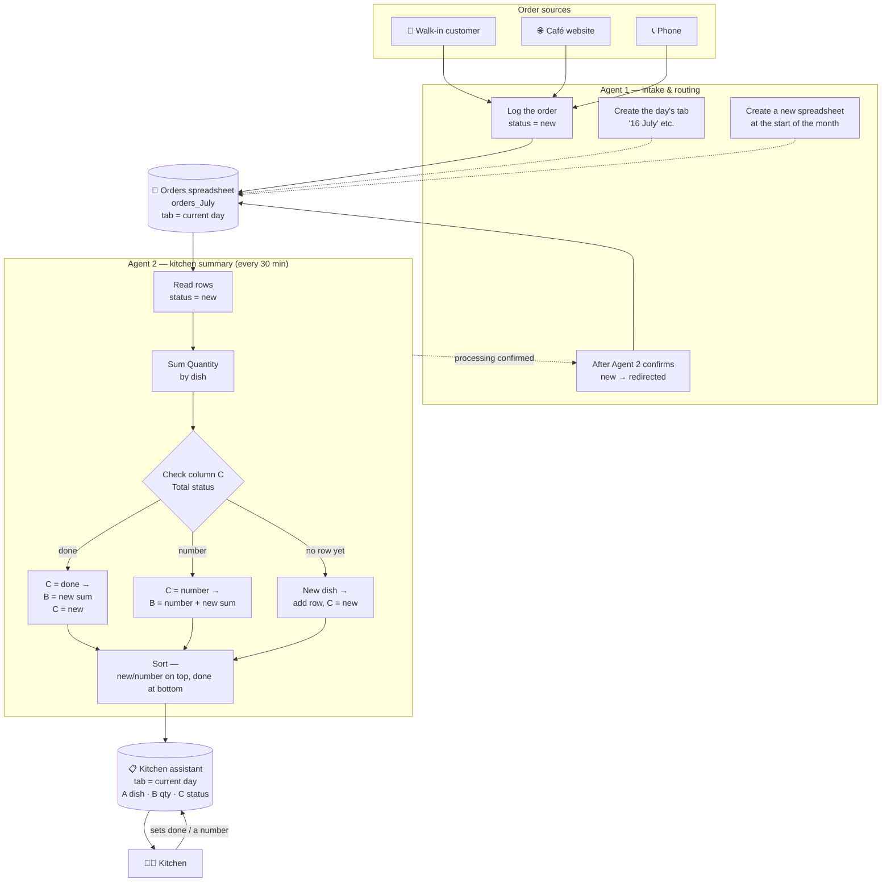
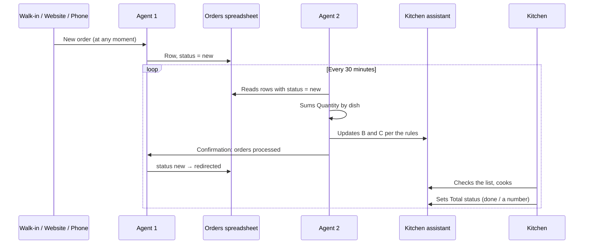

# System Architecture

## Components

| Component | Role |
|---|---|
| 3 order sources | Walk-in customer, café website, phone call |
| **Agent 1** | Order intake, status tracking, sheet/spreadsheet rotation by day and month |
| Orders sheet (`orders_<month>`) | The "source" spreadsheet, one tab per day |
| **Agent 2** | Every 30 minutes, re-tallies orders by dish and updates the kitchen's list |
| `kitchen assistant_<month>` spreadsheet | The kitchen's working list, one tab per day |
| Kitchen | Cooks from the list, manually sets the actual status |

## Overall diagram

## Syncing over time (the 30-minute cycle)

## Why it's built this way

- **Write access is split.** Agent 2 only reads the orders spreadsheet and writes to kitchen assistant; Agent 1 is the only one that changes status in the orders spreadsheet. This rules out a race condition where two processes edit the same status field at once.
- **`redirected` is only set after confirmation.** If Agent 2 fails mid-cycle, the unprocessed orders stay `new` and get picked up next time — no data is lost.
- **Column C ("Total status") is written only by the kitchen**, except in two moments: creating a new row and reactivating a row out of `done` — there, Agent 2 sets it to `new` to signal "there's something new to cook for this dish again."
