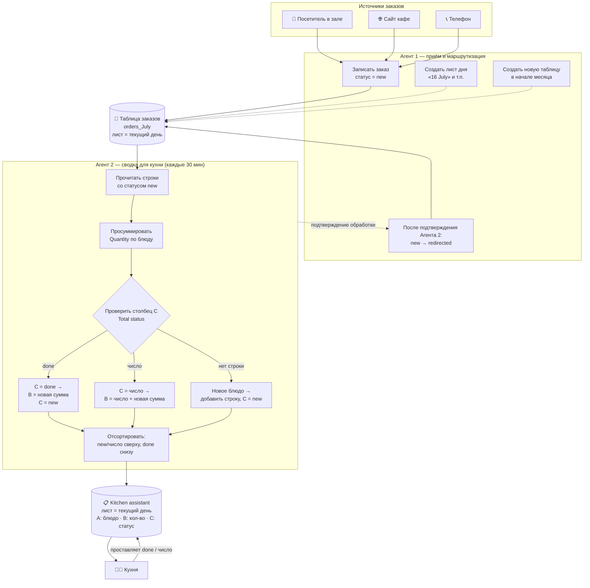
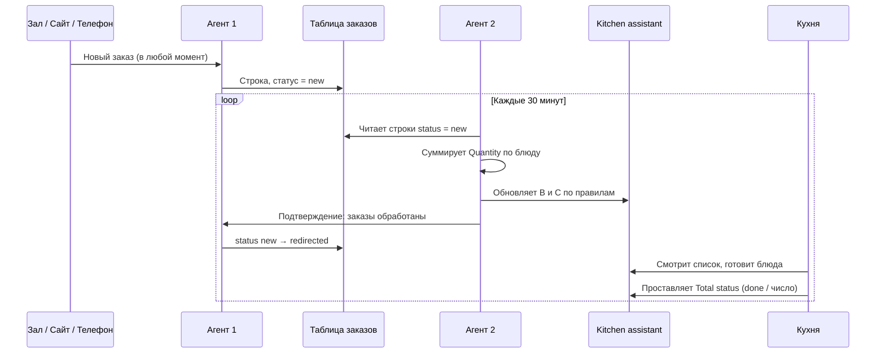

# Архитектура системы

## Компоненты

| Компонент | Роль |
|---|---|
| 3 источника заказов | Посетитель в зале, сайт кафе, телефонный звонок |
| **Агент 1** | Приём заказов, ведение статусов, ротация листов/таблиц по дням и месяцам |
| Таблица заказов (`orders_<месяц>`) | "Исходная" таблица, лист = текущий день |
| **Агент 2** | Каждые 30 минут пересчитывает заказы по блюдам и обновляет список для кухни |
| Таблица `kitchen assistant_<месяц>` | Рабочий список кухни, лист = текущий день |
| Кухня | Готовит по списку, вручную проставляет фактический статус |

## Общая схема

## Синхронизация во времени (цикл 30 минут)

## Почему именно так

- **Разделение прав на запись.** Агент 2 только читает исходную таблицу и пишет в kitchen assistant; Агент 1 — единственный, кто меняет статус в исходной таблице. Это исключает состояние гонки (race condition), когда два процесса одновременно правят один и тот же статус.
- **`redirected` выставляется только после подтверждения.** Если Агент 2 упадёт на середине цикла, необработанные заказы останутся в статусе `new` и будут подхвачены в следующий раз — данные не теряются.
- **Столбец C ("Total status") пишет только кухня**, кроме двух моментов: создание новой строки и реактивация строки из `done` — тогда Агент 2 подставляет `new`, чтобы сигнализировать "по этому блюду снова есть, что готовить".
