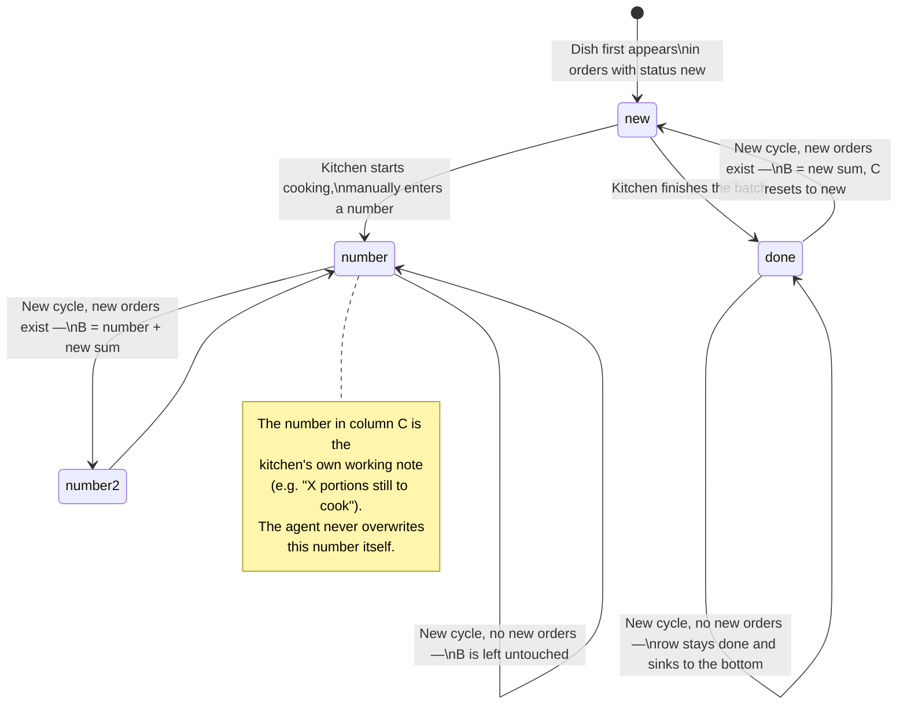
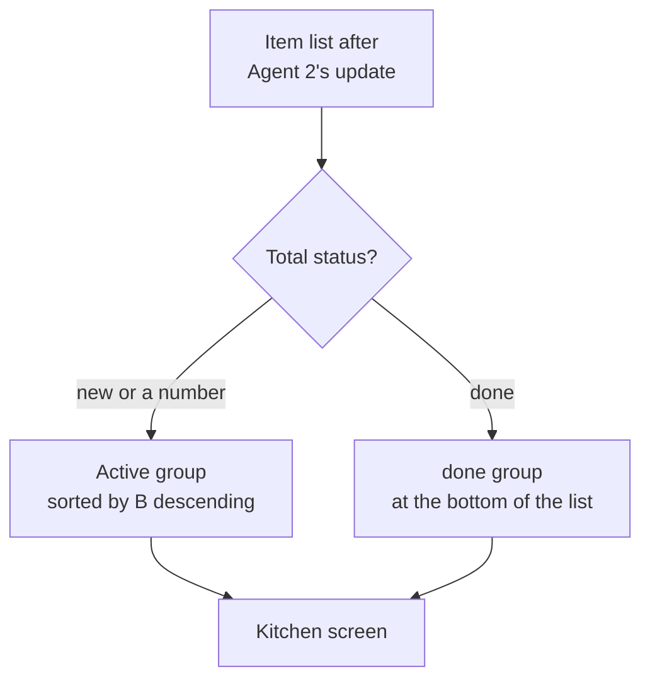
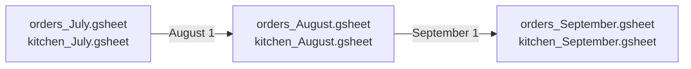

# Order Lifecycle and Spreadsheet Rotation

## 1. Lifecycle of a dish row in Kitchen Assistant

Each item (dish/drink) moves through a simple state machine in the **Total status** column:



## 2. Kitchen screen sorting rule

The kitchen screen must always show **what genuinely needs cooking right now**, not what's already done.



The rule is simple: a row only sinks to the bottom if it's `done` **and** no new orders for that dish showed up in the last 30-minute cycle. As soon as a new batch arrives, the status resets to `new` and the dish moves back to the top.

## 3. Daily tab rotation

Every calendar day, Agent 1 creates a new tab in the orders spreadsheet, and Agent 2 creates a matching, identically named tab in Kitchen Assistant. The naming format is `<day> <month>`, e.g. `16 July`.

```mermaid
flowchart LR
    subgraph Month["orders_July / kitchen_July"]
        D1["Tab \"15 July\""]
        D2["Tab \"16 July\" (current)"]
        D3["Tab \"17 July\""]
    end
    D1 -.archived, no longer updated.-> D1
    D2 -->|"00:00 → new day"| D3
```

Past days' tabs are never deleted or modified — they're a historical archive of orders and of what was actually cooked (based on the final values in column C).

## 4. Monthly spreadsheet rotation

At the start of a new calendar month, Agent 1 creates a **brand-new pair of files** — the source and destination spreadsheets — instead of adding yet another tab to an ever-growing file.



Reasons for this specific design:

- **Performance.** Google Sheets slows down noticeably with many tabs/rows in one file — monthly rotation keeps files lean.
- **Access rights and backups.** Last month's file can simply be frozen (set read-only, exported to archive) without touching current work.
- **Easy navigation.** It's easier for the owner to find "June's orders" than to scroll through one giant file spanning the whole year.

## 5. What happens to an order from intake to cooking

```mermaid
flowchart LR
    O["Order received\n(status: new)"] --> P["Agent 2 sums it up\nevery 30 min"]
    P --> Q["Appears/updates\nin Kitchen Assistant"]
    Q --> R["Agent 1 flips the source row:\nnew → redirected"]
    R --> S["Kitchen cooks,\nsets done/a number"]
    S --> T{"New matching\ndishes in 30 min?"}
    T -->|Yes| Q
    T -->|No| U["Stays done,\nsinks to the bottom"]
