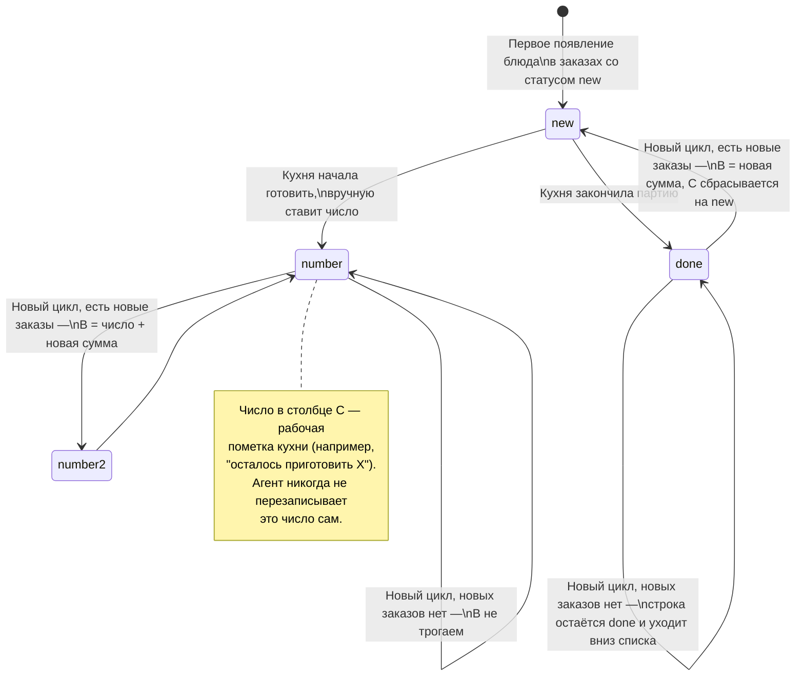
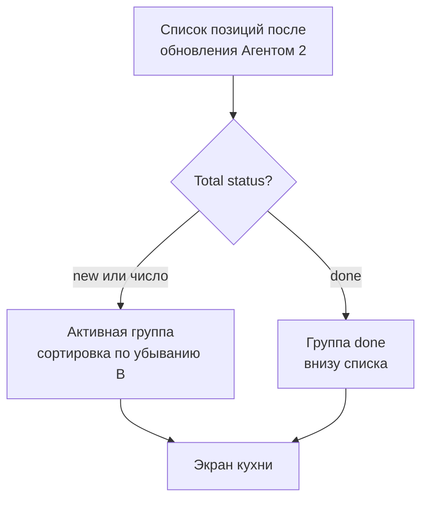
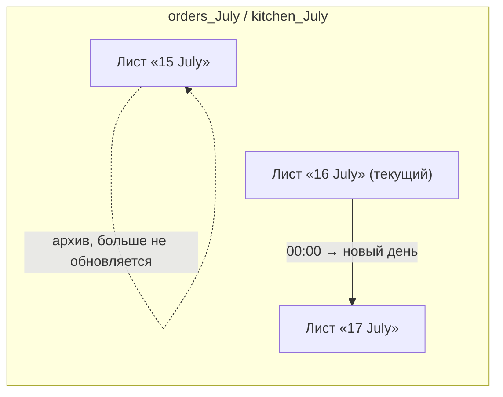
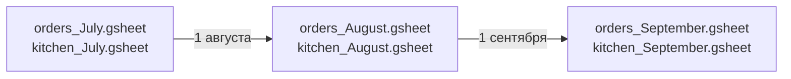

# Жизненный цикл заказа и ротация таблиц

## 1. Жизненный цикл строки блюда в Kitchen Assistant

Каждая позиция (блюдо/напиток) проходит через простой конечный автомат в столбце **Total status**:



## 2. Правило сортировки экрана кухни

На экране кухни всегда должно быть видно **что реально нужно готовить сейчас**, а не то, что уже готово.



Правило простое: строка "тонет" вниз только если она `done` **и** в последнем 30-минутном цикле по этому блюду не появилось новых заказов. Как только приходит новая партия — статус сбрасывается на `new`, и блюдо возвращается наверх.

## 3. Ротация листов по дням

Каждый календарный день Агент 1 создаёт новый лист в исходной таблице, а Агент 2 — синхронизированный по названию лист в Kitchen Assistant. Формат названия — `<день> <месяц>`, например `16 July`.



Листы прошлых дней не удаляются и не изменяются — это исторический архив заказов и того, что реально приготовили (по итоговым значениям столбца C).

## 4. Ротация таблиц по месяцам

В начале нового календарного месяца Агент 1 создаёт **новую пару файлов** — исходную и итоговую таблицу — вместо того чтобы добавлять ещё один лист в бесконечно растущий файл.



Причины именно такого решения:

- **Производительность.** Google Sheets ощутимо тормозит при большом количестве листов/строк в одном файле — помесячная ротация держит файлы компактными.
- **Права доступа и бэкапы.** Файл за прошлый месяц можно спокойно заморозить (перевести в read-only, выгрузить в архив), не трогая текущую работу.
- **Простая навигация.** Владельцу кафе проще найти "заказы за июнь", чем прокручивать один гигантский файл с начала года.

## 5. Что происходит с заказом от момента приёма до готовки

```mermaid
flowchart LR
    O["Заказ принят\n(статус: new)"] --> P["Агент 2 суммирует\nкаждые 30 мин"]
    P --> Q["Появляется/обновляется\nв Kitchen Assistant"]
    Q --> R["Агент 1 переводит\nисходную строку: new → redirected"]
    R --> S["Кухня готовит,\nпроставляет done/число"]
    S --> T{"Новые такие же\nблюда за 30 мин?"}
    T -->|Да| Q
    T -->|Нет| U["Остаётся done,\nуходит вниз списка"]
